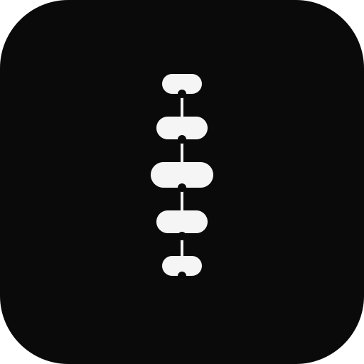

<p align="center">
  <a href="https://github.com/ksaad20/Spine">
    
  </a>
</p>

<!-- BADGES -->
<p align="center">
  <!-- DOI -->
  <a href="https://doi.org/10.5281/zenodo.21723504">
    
  </a>
  <!-- License -->
  <a href="https://github.com/ksaad20/Spine/blob/main/LICENSE">
    
  </a>
  <!-- Release -->
  <a href="https://github.com/ksaad20/Spine/releases">
    
  </a>
  <!-- Stars -->
  <a href="https://github.com/ksaad20/Spine/stargazers">
    
  </a>
  <!-- Forks -->
  <a href="https://github.com/ksaad20/Spine/network/members">
    
  </a>
  <!-- Issues -->
  <a href="https://github.com/ksaad20/Spine/issues">
    
  </a>
  <!-- Contributors -->
  <a href="https://github.com/ksaad20/Spine/graphs/contributors">
    
  </a>
  <!-- Last Commit -->
  <a href="https://github.com/ksaad20/Spine/commits/main">
    
  </a>
  <!-- Repo Size -->
  <a href="https://github.com/ksaad20/Spine">
    
  </a>
  <!-- Language -->
  <a href="https://github.com/ksaad20/Spine">
    
  </a>
</p>

# Spine

**The Backbone of Robotics.**

Spine is an open-source robotics platform that aims to provide a universal foundation for building, deploying, and scaling robotic systems across diverse hardware.

Modern robotics is fragmented. Every robot often requires custom drivers, hardware interfaces, communication layers, and software stacks. Spine seeks to simplify this by defining a common platform that enables developers to write robotics software once and deploy it across many robot architectures.

Our long-term vision is to become a universal robotics platform that enables interoperability among hardware manufacturers, software developers, researchers, and autonomous systems.

---

## Vision

Create a robotics ecosystem where applications are portable, hardware is modular, and intelligent systems can operate across robots without vendor-specific rewrites.

---

## Mission

* Standardize robotics hardware interfaces.
* Build a modular Hardware Abstraction Layer (HAL).
* Enable portable robotics applications.
* Provide a secure and extensible runtime.
* Foster an open ecosystem for robotics innovation.

---

# Core Principles

### Universal

Support wheeled robots, robotic arms, drones, humanoids, underwater robots, industrial automation, agricultural robots, and future robotic systems through common interfaces.

### Modular

Every component should be replaceable without requiring changes to the rest of the system.

### Hardware Agnostic

Applications should interact with capabilities rather than vendor-specific devices.

### AI Native

Artificial intelligence should integrate naturally into the platform rather than existing as an afterthought.

### Open

Spine is designed to encourage collaboration from researchers, engineers, companies, and the open-source community.

---

# Long-Term Architecture

```
Applications
      │
Spine SDK
      │
Robot Services
────────────────────────
Navigation
Vision
Localization
Planning
Control
Mapping
AI Runtime
────────────────────────
Hardware Abstraction Layer (HAL)
────────────────────────
Drivers
────────────────────────
Hardware
```

---

# Project Roadmap

## Phase 1

* Define platform architecture
* Design Hardware Abstraction Layer
* Create driver specification
* Publish technical standards

## Phase 2

* Reference HAL implementation
* Driver framework
* Simulation environment
* SDK

## Phase 3

* Package ecosystem
* Developer tooling
* Security framework
* Robot deployment tools

## Phase 4

* Cross-platform robotics applications
* Cloud robotics
* Distributed robot coordination
* Industry adoption

---

# Guiding Philosophy

Robotics should not require rewriting software for every new machine.

Applications should target a stable platform rather than individual hardware implementations.

Spine exists to make robotics software portable, maintainable, and scalable.

---

# Contributing

Spine is in its early design stage.

We welcome contributions in:

* Robotics
* Embedded systems
* Real-time systems
* Mechanical engineering
* Artificial intelligence
* Computer vision
* Motion planning
* Control systems
* Security
* Documentation

---

# License

Apache License 2.0

---

> **Spine aims to become the backbone of robotics—an open foundation for the next generation of intelligent machines.**
> 
